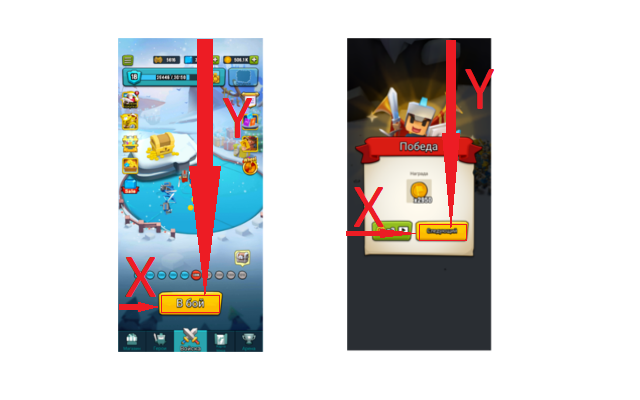

# Art Of Wars game bot
**IMPORTANT: This bot is not supposed to use for cheating. It does not give a great advantage for the player because the gold is not the most valuable resource in the game.**

This bot shows how you can use the [Android MonkerRunner](https://developer.android.com/studio/test/monkeyrunner) to emulate user actions.

## Usage
```
clone into $ANDROID_SDK_ROOT\tools\bin
cd $ANDROID_SDK_ROOT\tools\bin
monkeyrunner.bat artsofwarbot/artsofwarbot.py runloop
```

This bot is device-specific. It is created on Samsung A50. On your device, you will have different button screens and different button positions.



You have to edit buttons array and images in buttons folder.
```python
buttons = [
    {
        'x': 325,
        'y': 1922,
        'width': 420,
        'height': 114,
        'imgfile': 'main-screen-fight.png',
        'img': None
        },
```
You can take a screenshot with **snapshot** command.
